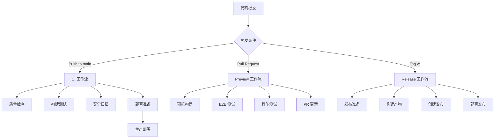

# 🚀 AI Galaxy CI/CD 流水线指南

本指南详细介绍了 AI Galaxy 项目的完整 CI/CD 流水线实现。

## 📋 流水线概览

### 工作流架构


## 🔧 工作流详解

### 1. 🔍 持续集成 (ci.yml)

**触发条件：**
- Push 到 `main`, `master`, `develop`, `feature/*`, `hotfix/*` 分支
- Pull Request 到 `main`, `master`, `develop` 分支
- 手动触发

**主要任务：**
- **质量检查 (Quality Checks)**
  - 代码格式化检查
  - ESLint 静态分析
  - TypeScript 类型检查
  - Prisma 模式验证
  - 安全审计
  - 包大小分析
  - 依赖检查

- **构建测试 (Build & Test)**
  - 多 Node.js 版本支持 (18, 20)
  - 应用构建验证
  - 自动化测试执行
  - 覆盖率报告

- **Docker 构建测试**
  - Docker 镜像构建
  - 容器启动测试

- **安全扫描**
  - Trivy 漏洞扫描
  - SARIF 报告上传

### 2. 🌿 预览部署 (preview.yml)

**触发条件：**
- Pull Request 创建/更新
- 手动触发

**主要功能：**
- **预览环境构建**
  - 创建部署包
  - 部署到预览环境
  - 生成预览 URL

- **端到端测试**
  - Playwright 自动化测试
  - 基础功能验证
  - 导航测试
  - 管理页面检查

- **性能测试**
  - Lighthouse CI 性能分析
  - 多页面性能评估
  - 性能指标报告

- **PR 集成**
  - 自动更新 PR 评论
  - 显示测试结果
  - 提供预览链接

### 3. 🚀 发布自动化 (release.yml)

**触发条件：**
- Git 标签推送 (`v*`)
- 手动触发发布

**发布流程：**
- **发布准备**
  - 版本号确定
  - 变更日志生成
  - 提交统计

- **构建产物**
  - Web 应用包
  - Docker 镜像
  - 源码归档
  - 构建报告

- **GitHub 发布**
  - 创建发布页面
  - 上传构建产物
  - 生成校验和
  - 发布说明

- **自动部署**
  - 生产环境部署
  - 版本号更新
  - 发布总结

## 🛠️ 配置说明

### 环境变量配置

在 GitHub Repository Settings → Secrets and Variables → Actions 中配置：

#### 必需的 Secrets
```bash
# 服务器部署
HOST=your-server-ip                    # 服务器 IP 地址
USERNAME=your-server-username          # 服务器用户名  
SSH_KEY=your-private-ssh-key          # SSH 私钥
PORT=22                               # SSH 端口

# 数据库
DATABASE_URL=postgresql://...          # PostgreSQL 连接字符串

# Docker 注册表 (选择其一)
DOCKER_HUB_USERNAME=your-username      # Docker Hub 用户名
DOCKER_HUB_TOKEN=your-token           # Docker Hub 访问令牌

# 腾讯云 (可选)
TCR_USERNAME=your-tcr-username         # 腾讯云容器镜像服务用户名
TCR_PASSWORD=your-tcr-password         # 腾讯云容器镜像服务密码
TCR_NAMESPACE=your-namespace           # 命名空间

# 阿里云 (可选) 
ALIYUN_USERNAME=your-aliyun-username   # 阿里云用户名
ALIYUN_PASSWORD=your-aliyun-password   # 阿里云密码
ALIYUN_NAMESPACE=your-namespace        # 命名空间

# 其他
SESSION_SECRET=your-session-secret     # 会话密钥
DOMAIN=your-domain.com                 # 域名
```

### 工作流权限配置

确保在 Repository Settings → Actions → General 中启用：
- ✅ Read and write permissions
- ✅ Allow GitHub Actions to create and approve pull requests

## 📊 监控和报告

### 1. 构建状态徽章

在 README.md 中添加状态徽章：
```markdown
[](https://github.com/your-username/AIgalaxy-2/actions)
[](https://github.com/your-username/AIgalaxy-2/actions)
[](https://github.com/your-username/AIgalaxy-2/releases)
```

### 2. 部署状态检查

访问这些链接检查部署状态：
- 🌐 生产环境：https://mpai.openpenpal.com
- ⚙️ 管理后台：https://mpai.openpenpal.com/admin
- 🏥 健康检查：https://mpai.openpenpal.com/api/health

### 3. 监控工具集成

可以集成以下监控工具：
- **Codecov** - 代码覆盖率
- **Lighthouse CI** - 性能监控
- **Sentry** - 错误追踪
- **DataDog** - 应用性能监控

## 🔄 使用指南

### 日常开发流程

1. **创建功能分支**
   ```bash
   git checkout -b feature/new-feature
   ```

2. **开发和提交**
   ```bash
   git add .
   git commit -m "feat: add new feature"
   git push origin feature/new-feature
   ```

3. **创建 Pull Request**
   - 自动触发预览部署
   - 运行 E2E 和性能测试
   - 查看 PR 中的自动评论

4. **合并到主分支**
   - 自动触发 CI 流水线
   - 运行质量检查和安全扫描
   - 自动部署到生产环境

### 发布新版本

1. **创建发布标签**
   ```bash
   git tag v1.2.3
   git push origin v1.2.3
   ```

2. **或手动触发发布**
   - 访问 Actions → Release Automation
   - 点击 "Run workflow"
   - 输入版本号和发布类型

### 热修复流程

1. **创建热修复分支**
   ```bash
   git checkout -b hotfix/critical-fix
   ```

2. **修复和测试**
   ```bash
   git commit -m "fix: resolve critical issue"
   git push origin hotfix/critical-fix
   ```

3. **快速发布**
   ```bash
   git tag v1.2.4
   git push origin v1.2.4
   ```

## 🚨 故障排除

### 常见问题

1. **构建失败**
   - 检查 Node.js 版本兼容性
   - 验证 package.json 依赖
   - 查看构建日志中的错误信息

2. **部署失败**
   - 确认服务器连接配置
   - 检查环境变量设置
   - 验证数据库连接字符串

3. **测试失败**
   - 检查测试环境配置
   - 更新测试用例
   - 验证预览环境可访问性

4. **Docker 问题**
   - 检查 Dockerfile 语法
   - 验证镜像注册表凭据
   - 确认多架构构建支持

### 调试技巧

1. **启用调试日志**
   ```bash
   # 在工作流中添加
   - name: Enable Debug
     run: echo "ACTIONS_STEP_DEBUG=true" >> $GITHUB_ENV
   ```

2. **SSH 到运行器调试**
   ```yaml
   - name: Setup tmate session
     uses: mxschmitt/action-tmate@v3
     if: failure()
   ```

3. **本地复现问题**
   ```bash
   # 使用 act 在本地运行 Actions
   act -j build-and-test
   ```

## 🔧 自定义配置

### 添加自定义测试

在 `package.json` 中添加测试脚本：
```json
{
  "scripts": {
    "test": "jest",
    "test:e2e": "playwright test",
    "test:coverage": "jest --coverage"
  }
}
```

### 自定义部署环境

修改 `docker-deploy.yml` 中的环境配置：
```yaml
environment:
  name: staging
  url: https://staging.yourdomain.com
```

### 添加自定义通知

集成 Slack 或其他通知服务：
```yaml
- name: Notify Slack
  uses: 8398a7/action-slack@v3
  with:
    status: ${{ job.status }}
    webhook_url: ${{ secrets.SLACK_WEBHOOK }}
```

## 📚 进阶配置

### 1. 多环境部署策略

```yaml
strategy:
  matrix:
    environment: [staging, production]
```

### 2. 条件部署

```yaml
if: github.ref == 'refs/heads/main' && github.event_name == 'push'
```

### 3. 依赖缓存优化

```yaml
- name: Cache node_modules
  uses: actions/cache@v3
  with:
    path: node_modules
    key: ${{ runner.os }}-node-${{ hashFiles('package-lock.json') }}
```

### 4. 并行作业优化

```yaml
jobs:
  test:
    strategy:
      matrix:
        test-group: [unit, integration, e2e]
```

## 🔒 安全最佳实践

1. **密钥管理**
   - 使用 GitHub Secrets 存储敏感信息
   - 定期轮换 API 密钥和令牌
   - 限制密钥访问权限

2. **镜像安全**
   - 定期扫描容器镜像漏洞
   - 使用最小化基础镜像
   - 及时更新依赖包

3. **部署安全**
   - 使用 SSH 密钥而非密码
   - 限制服务器访问权限
   - 启用防火墙和安全组

4. **代码质量**
   - 强制代码审查
   - 自动化安全扫描
   - 依赖漏洞检查

---

## 🎯 最佳实践总结

✅ **DO (推荐做法)**
- 小步快跑，频繁提交
- 编写清晰的提交信息
- 在 PR 中进行代码审查
- 保持构建的快速和可靠
- 监控部署状态和性能

❌ **DON'T (避免做法)**
- 跳过测试直接部署
- 在生产环境调试
- 硬编码敏感信息
- 忽略构建警告
- 缺乏回滚计划

通过遵循这些指南，你的 AI Galaxy 项目将拥有一个健壮、高效的 CI/CD 流水线，确保代码质量和部署可靠性。